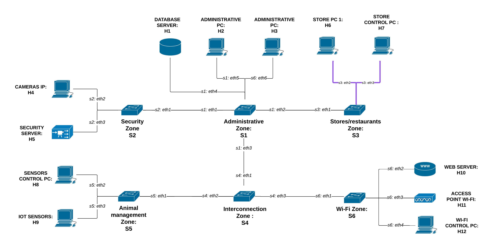
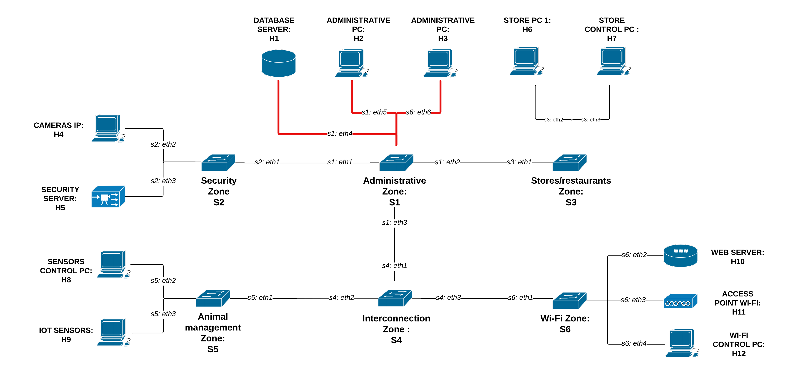
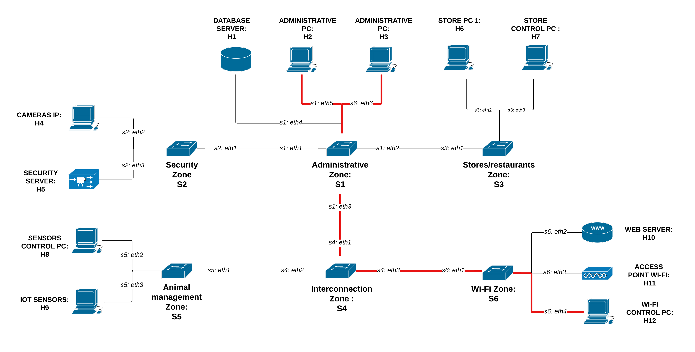
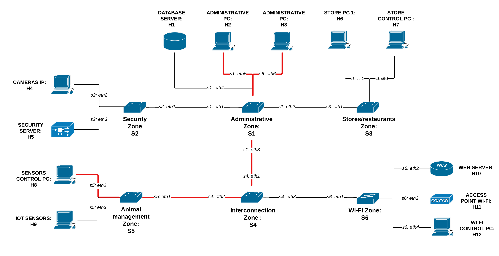
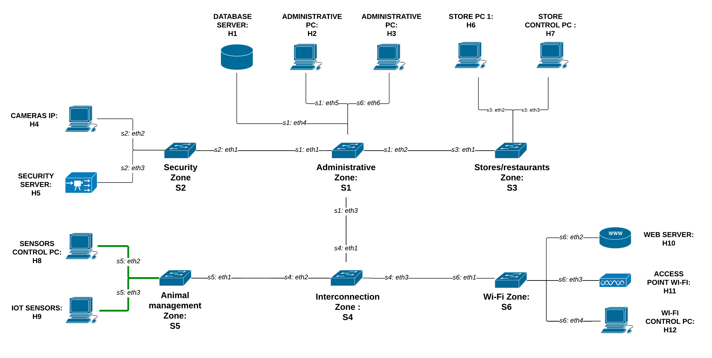

# Smart Zoo Network Management System

> **Authors:** Alberto Vendramini, Giorgia Gabardi, Nicolò Marconi                                                         
> **Course:** Softwarized and virtualized network                                                                            
> **Institution:** University of Trento  
> **Academic Year:** 2024–2025

## Project Overview 

A dynamic and modular SDN-based system for managing network slices in real time. This platform enables activation and deactivation of network slices, real-time QoS configuration and intuitive slice control through both CLI and GUI interfaces. Built using Mininet for emulation and the Ryu controller for policy enforcement, the system demonstrates how network resources can be intelligently and flexibly allocated in a real-world environment.

## Table of contents

## Project Idea

The project simulates a smart, software-defined network for a modern zoo — a complex environment with diverse operational needs. The network integrates multiple functional zones such as administration, animal care, retail, security and visitor services.

Using SDN and network slicing, the system dynamically adapts to different scenarios:

- **Daytime**: prioritizes administrative tasks, retail transactions and visitor Wi-Fi access.
- **Nighttime**: reallocates bandwidth to security systems and minimizes unnecessary traffic.

## Key Features

- Dynamic creation and deletion of network slices
- Real-time QoS adjustment per slice
- Web-based GUI for intuitive slice management
- Mininet-based emulation of the network topology
- Ryu SDN controller integration for traffic control and policy enforcement
- Modular and extensible architecture for testing other SDN strategies

## Installation 
### Required Packages 
### Project Structure
### How to Run
### How to verify

## System architecture

The system is composed of:

- **1 SDN Controller** (Ryu)
- **12 Hosts**, each representing a key component of the smart zoo
- **6 OpenFlow Switches**, divided into functional network zones

All links between switches and hosts are configured with **10 Mbps bandwidth**

### Hosts

| Host | Role | Description |
|------|------|-------------|
| **H1** | Database Server | Centralizes and stores all zoo data, including tickets, animal info and financial records |
| **H2** | Administrative PC | Manages bookings, accounting and administrative tasks |
| **H3** | Administrative PC | Supports admin operations alongside H2 |
| **H4** | IP Cameras | Provides real-time surveillance with motion detection |
| **H5** | Security Server | Handles access control, alarms and video storage |
| **H6** | Store PC 1 | Used in shops for sales and inventory management |
| **H7** | Store Control PC | Coordinates retail operations |
| **H8** | Sensors Control PC | Processes data from IoT sensors and performs analytics |
| **H9** | IoT Sensors | Monitor environmental conditions (e.g. temperature, humidity) and send alerts |
| **H10** | Web Server | Hosts the zoo website and booking system; provides APIs |
| **H11** | Wi-Fi Access Point | Offers wireless connectivity to visitors and staff |
| **H12** | Wi-Fi Control PC | Manages user access and Wi-Fi quality of service |

### OpenFlow Switches

| Switch | Zone | Function |
|--------|------|----------|
| **S1** | Administrative Zone | Manages traffic related to admin tasks like bookings and coordination |
| **S2** | Security Zone | Handles traffic for security systems such as alarms and cameras |
| **S3** | Stores/Restaurants Zone | Supports commercial operations (shops, payments) |
| **S4** | Interconnection Zone | Core switch connecting all zones and enabling cross-communication |
| **S5** | Animal Management Zone | Focuses on animal care with sensors and control systems |
| **S6** | Wi-Fi Zone | Manages visitor and staff wireless connectivity |

  
   
  <em>Figure 1: System architecture</em>

## Network Slicing Overview

The network is logically divided into multiple **slices**, each representing a virtual, isolated segment of the physical network. These slices allow fine-grained traffic control and dynamic resource allocation based on time-of-day and functional needs of the zoo.

Each slice connects specific hosts and zones for dedicated tasks (e.g., administration, security, retail). Slices can be activated or deactivated in real time via the SDN controller and are dynamically managed according to operational priorities (day/night mode).

### Slice Descriptions

#### Store Management Slice (DAY/NIGHT)

Day: This slice connects store PCs to the central database during the day to support real-time sales and inventory updates.

    <em>Figure 2: Store Management Slice – Daytime</em> 

Night: At night, it enables store management systems to sync with the database for maintenance and data backups, ensuring consistency and reliability across retail operations.

    <em>Figure 3: Store Management Slice – Nighttime</em> 

#### Web Access Slice (DAY)

This slice enables the web server to access both the central database and the IoT sensors in real time.
It powers the zoo’s online services, allowing visitors to book tickets, access real-time data and interact with sensor-driven content through the website and external APIs.

    <em>Figure 3: Web Access Slice</em> 

#### Wi-Fi Access Slice (DAY)

This slice connects Wi-Fi users, including staff and visitors, to the web server to enable access to online services such as ticket booking and zoo information. It is also responsible for managing the wireless network through a dedicated Wi-Fi control PC, which handles traffic prioritization and access control.

    <em>Figure 4: Wi-Fi Access Slice</em> 

#### Administrative Core Slice (DAY/NIGHT)

This internal slice supports the zoo's administrative operations, including accounting, ticket bookings and data management related to animals, staff and visitors. It ensures secure and uninterrupted communication between administrative PCs and the central database, operating throughout both day and night.

    <em>Figure 5: Administrative Core Slice </em> 

#### Administration–Store Sync Slice (DAY/NIGHT)
This slice enables real-time coordination between administrative PCs and store systems to ensure smooth and efficient daily operations. It allows administrative staff to monitor, support and synchronize store-related activities such as sales reports, inventory tracking and financial logging with full visibility and control.

    <em>Figure 6: Administration–Store Sync Slice </em> 

#### Administration–Wi-Fi Control Slice (DAY/NIGHT)

This slice enables administrative PCs to manage and monitor the entire Wi-Fi infrastructure of the zoo. It provides full control over access permissions, traffic prioritization and network performance, allowing administrators to ensure a reliable and secure wireless environment for both staff and visitors.

    <em>Figure 7: Administration–Wi-Fi Control Slice </em> 

#### Administration–Security Slice (DAY/NIGHT)
This slice connects the administrative PCs to the security server, enabling real-time access control, alarm system management and surveillance monitoring throughout the zoo. It ensures that administrative personnel can securely oversee and intervene in security operations both during the day and night.

    <em>Figure 8: Administration–Security Slice </em> 

#### Administration–Animal Data Slice (DAY/NIGHT)
This slice enables administrative systems to communicate seamlessly with animal monitoring devices and sensor control PCs. It supports real-time data exchange and management of environmental sensors, facilitating efficient animal care and monitoring throughout the zoo.

    <em>Figure 9: Administration–Animal Data Slice </em> 

#### Animal Management Slice (DAY/NIGHT)
Day:This slice is active during the day to manage and monitor animals using environmental sensors and a dedicated control PC, ensuring real-time tracking of animal conditions and behaviors. 

    <em>Figure 10: Animal Management Slice - Daytime </em> 

Night: During the night, the slice operates in a limited mode, primarily allowing access to the central database for data updates and system maintenance, with reduced active monitoring.

    <em>Figure 11: Animal Management Slice - Nighttime </em> 

#### Security Monitoring Slice (DAY/NIGHT)

Day: This slice connects the IP cameras with the security server to enable live surveillance and threat detection in real time, ensuring the safety of the zoo premises.

    <em>Figure 12: Security Monitoring Slice - Daytime</em> 

Night: During the night, it links security systems to the central database for data synchronization and allows remote monitoring, maintaining security oversight even when on-site activity is reduced.

    <em>Figure 13: Security Monitoring Slice - Nighttime</em> 

## GUI Application 

The GUI application provides an intuitive and user-friendly interface to manage and monitor network slices in real time. Users can activate/deactivate slices, view current network status and dynamically adjust QoS configurations without needing command-line interaction.

    <em> GUI Application – Interactive slice management and monitoring</em> 

## CLI REST Commands Overview

The system includes a RESTful API that allows direct interaction with the SDN controller and network slicing logic via CLI commands. Below is an overview of the most relevant `curl` commands for controlling the network from the terminal:

| **Action**                | **Description**                                                                                       | **Command**                                                                                                              |
|---------------------------|-------------------------------------------------------------------------------------------------------|--------------------------------------------------------------------------------------------------------------------------|
| Change mode               | Set the time mode (Day/Night)                                                  | `curl -X POST http://localhost:8080/mode/set -H "Content-Type: application/json" -d '{"mode": "1"}'`                     |
| Get current mode          | Retrieve the current time mode mode                                                                | `curl -X GET http://localhost:8080/mode/get`                                                                             |
| Add a slice               | Add a new slice with a given ID and mode                                                             | `curl -X POST http://localhost:8080/slice/add -H "Content-Type: application/json" -d '{"slice_id": "9", "mode": "1"}'`   |
| Remove a slice            | Remove an existing slice                                                                             | `curl -X POST http://localhost:8080/slice/remove -H "Content-Type: application/json" -d '{"slice_id": "9", "mode": "1"}'`|
| Get active slices status  | Display the status of all active slices                                                              | `curl -X GET http://localhost:8080/slices/status`                                                                         |
| Reset forwarding map      | Reset the forwarding map based on current slice configuration                                        | `curl -X POST http://localhost:8080/reset/map -H "Content-Type: application/json" -d '{"mode": 0}'`                      |
| Send full topology        | Trigger the controller to broadcast full topology to all slices                                     | `curl -X POST http://localhost:8080/topology/send`                                                                       |
| Access static file (HTML) | Access the web server for serving frontend files (e.g. GUI)                                          | `curl http://localhost:8080/index.html`                                                                                   |

### General Notes

- `mode = 0` → **Day**, `mode = 1` → **Night**  
  This value must be correctly set when performing time-specific operations.

- Before performing operations like **adding or removing slices**, ensure the controller is set to the appropriate time mode using:  
  `curl -X GET http://localhost:8080/mode/get`

- If you add or remove a slice in the wrong mode (e.g., adding a Day slice while in Night mode), it will not be active or behave as expected.

## QoS CLI Commands

These are the available CLI commands to manage Quality of Service (QoS) configurations via the REST API. You can use these commands to retrieve queue settings, set new queues, add or delete QoS rules on your OpenFlow switches.

| **Action**          | **Description**                                                             | **Command**                                                                                                                                                                                                                                                                                            |
|---------------------|-----------------------------------------------------------------------------|--------------------------------------------------------------------------------------------------------------------------------------------------------------------------------------------------------------------------------------------------------------------------------------------------------|
| Get queue config     | Retrieve queue configuration for all switches or a specific one             | `curl -X GET http://localhost:8080/qos/queue/all` `curl -X GET http://localhost:8080/qos/queue/{dpid}`                                                                                                                                                                                             |
| Set queue            | Configure or update QoS queue on a specific port                            | `curl -X POST http://localhost:8080/qos/queue/{dpid} -H "Content-Type: application/json" -d '{ "port_name": "s1-eth1", "type": "linux-htb", "max_rate": "100000000", "queues": [ { "max_rate": "50000000", "min_rate": "10000000" } ] }'`                                                            |
| Get QoS rules        | Show all QoS rules for a switch                                              | `curl -X GET http://localhost:8080/qos/rules/{dpid}`                                                                                                                                                                                                                                                  |
| Add QoS rule         | Add a QoS rule to a switch                                                  | `curl -X POST http://localhost:8080/qos/rules/{dpid} -H "Content-Type: application/json" -d '{ "priority": 1, "match": { "in_port": 1, "dl_type": "IPv4", "nw_proto": "TCP", "nw_dst": "10.0.0.2", "tp_dst": 5001 }, "actions": { "queue": 1 } }'`                                                   |
| Delete QoS rule      | Delete a specific QoS ID or all Qos IDs                                     | `curl -X DELETE http://localhost:8080/qos/rules/{dpid} -H "Content-Type: application/json" -d '{"qos_id": {qos_id}}'` `curl -X DELETE http://localhost:8080/qos/rules/{dpid} -H "Content-Type: application/json" -d '{"qos_id": "all"}'`                                                             |

### Notes - Order to Apply QoS CLI Commands
---------------------------------------

1. Set Queue (POST /qos/queue/{dpid})  
   First, configure the QoS queue on the target switch and port. Without this, QoS rules won’t have valid queues to apply.

2. Add QoS Rule (POST /qos/rules/{dpid})  
   After the queue is set, add QoS rules that specify how to use the configured queues (e.g., map certain traffic to a specific queue).

3. Get queue and Get rules (GET /qos/queue and GET /qos/rules)  
   Use these commands to check current queue and rule configurations.

4. Delete QoS rule (DELETE /qos/rules/{dpid})  
   Before deleting rules, use GET to verify which rule IDs actually exist. You can delete single rules or all rules with `qos_id: "all"`.
