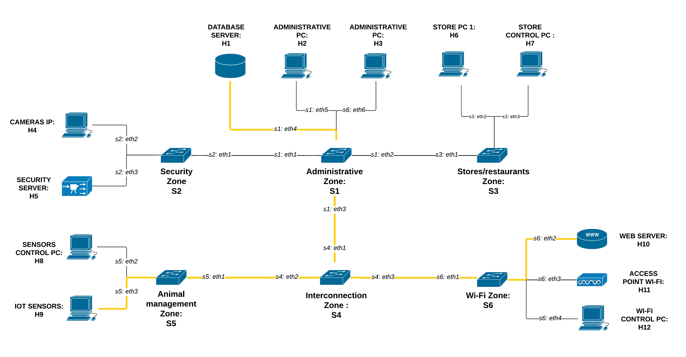
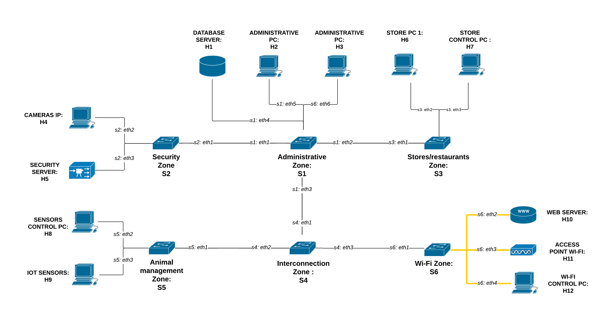
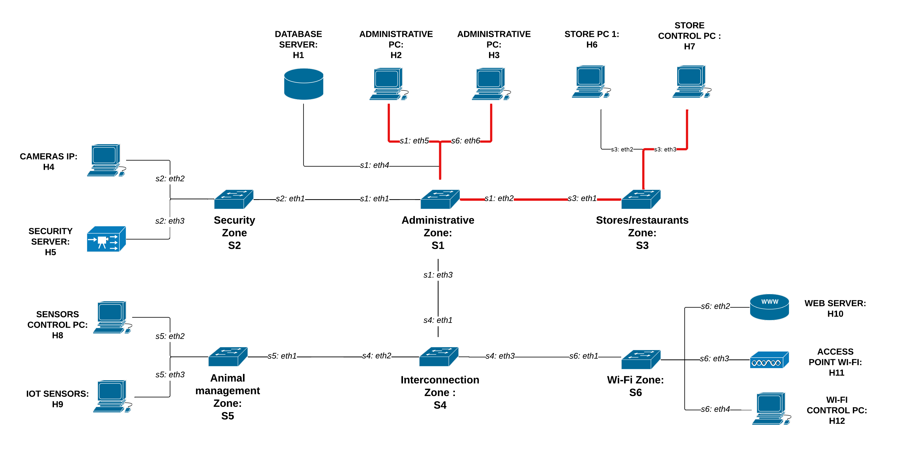
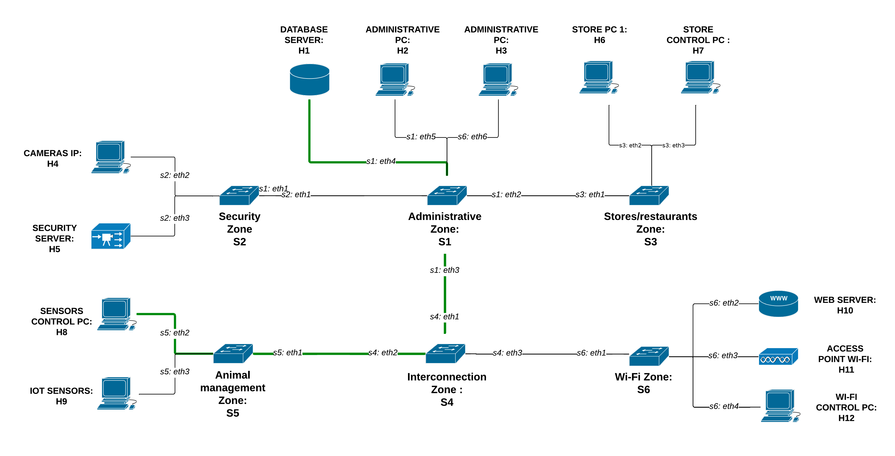
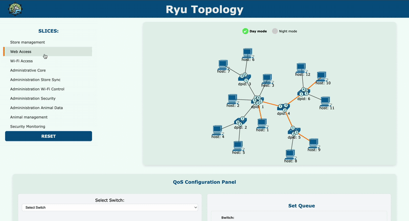

# OD-SDN-Slicing


> **Authors:** Alberto Vendramini, Giorgia Gabardi, Nicolò Marconi                                                         
> **Course:** Softwarized and virtualized network                                                                            
> **Institution:** University of Trento  
> **Academic Year:** 2024–2025

## Project Overview 

 OD-SDN-Slicing is a dynamic and modular SDN-based system for managing network slices in real time. This platform enables activation and deactivation of network slices, real-time QoS configuration and intuitive slice control through both CLI and GUI interfaces. Built using Mininet for emulation and the Ryu controller for policy enforcement, the system demonstrates how network resources can be intelligently and flexibly allocated in a real-world environment.

## Table of contents

- [Project Overview](#project-overview)
- [Project Idea](#project-idea)
- [Key Features](#key-features)
- [Project Structure](#project-structure)
- [System Architecture](#system-architecture)
  - [Hosts](#hosts)
  - [OpenFlow Switches](#openflow-switches)
- [Network Slicing Overview](#network-slicing-overview)
  - [Slice Descriptions](#slice-descriptions)
    - [Store Management Slice (DAY/NIGHT)](#store-management-slice-daynight)
    - [Web Access Slice (DAY)](#web-access-slice-day)
    - [Wi-Fi Access Slice (DAY)](#wi-fi-access-slice-day)
    - [Administrative Core Slice (DAY/NIGHT)](#administrative-core-slice-daynight)
    - [Administration–Store Sync Slice (DAY/NIGHT)](#administrationstore-sync-slice-daynight)
    - [Administration–Wi-Fi Control Slice (DAY/NIGHT)](#administrationwi-fi-control-slice-daynight)
    - [Administration–Security Slice (DAY/NIGHT)](#administrationsecurity-slice-daynight)
    - [Administration–Animal Data Slice (DAY/NIGHT)](#administrationanimal-data-slice-daynight)
    - [Animal Management Slice (DAY/NIGHT)](#animal-management-slice-daynight)
    - [Security Monitoring Slice (DAY/NIGHT)](#security-monitoring-slice-daynight)
- [Application Setup and Testing Commands](#application-setup-and-testing-commands)
  - [Installation](#installation)
  - [How to Run](#how-to-run)
  - [How to Test](#how-to-test)
- [GUI Application](#gui-application)
- [CLI REST Commands Overview](#cli-rest-commands-overview)
- [Common Errors](#common-errors)

## Project Idea

The project simulates a smart, software-defined network for a modern zoo — a complex environment with diverse operational needs. The network integrates multiple functional zones such as administration, animal care, retail, security and visitor services.

Using SDN and network slicing, the system dynamically adapts to different scenarios:

- **Day-time**: prioritizes administrative tasks, retail transactions and visitor Wi-Fi access.
- **Night-time**: reallocates bandwidth to security systems and minimizes unnecessary traffic.


## Key Features

- Dynamic activation and de-activation of network slices
- Real-time QoS adjustment per slice
- Web-based GUI for intuitive slice management
- Mininet-based emulation of the network topology
- Ryu SDN controller integration for traffic control and policy enforcement
- Modular and extensible architecture for testing other SDN strategies

## Project Structure

The structure of the project is as follows:

```
├── externals/
│   └── ryu/                    # Ryu SDN framework (git submodule)
├── first_topology/
│   ├── controller.py           # SDN controller logic with REST API endpoints
│   ├── MacToPortMapper.py      # Network slice management and compatibility logic  
│   ├── ProblemConstants.py     # Constants for slices and network configuration
│   └── topology.py             # Mininet topology definition for the zoo network
├── html/
│   ├── images/                 # SVG icons for network components
│   │   ├── host.svg
│   │   ├── router.svg
│   │   └── switch.svg
│   ├── index.html              # Main web interface
│   ├── topology.css            # Styles for the web GUI
│   └── topology.js             # Frontend logic for topology visualization and slice control
├── images/                     # Documentation and demo images
│   ├── gui_demo.gif
│   ├── Topology.png
│   └── slice_*.png             # Slice diagrams for different scenarios
└── Makefile                    # Build automation for running topology and controller
```

**Key directories and files:**

- **`externals/ryu/`** contains the Ryu SDN framework as a git submodule
- **`first_topology/`** contains the core SDN implementation:
  - `controller.py`: main SDN controller with REST API endpoints for slice management and QoS configuration  
  - `MacToPortMapper.py`: handles network slice activation/deactivation and compatibility checking
  - `ProblemConstants.py`: defines slice configurations and network constants
  - `topology.py`: Mininet script that creates the zoo network topology
- **`html/`** contains the web-based GUI:
  - `index.html`: main interface for slice management and network visualization
  - `topology.js`: frontend logic for D3.js topology rendering, slice control and QoS management
  - `topology.css`: styling for the web interface
  - `images/`: SVG icons for hosts, switches and routers used in the visualization
- **`images/`** contains documentation assets including topology diagrams and slice visualizations
- **`Makefile`** provides convenient commands to run the topology and controller

## System architecture

The system is composed of:

- **1 SDN Controller** (Ryu)
- **12 Hosts**, each representing a key component of the smart zoo
- **6 OpenFlow Switches**, divided into functional network zones

All links between switches and hosts are configured with **10 Mbps bandwidth**

### Hosts

| Host | Role | Description |
|------|------|-------------|
| **H1** | Database Server | Centralizes and stores all zoo data, including tickets, animal info and financial records |
| **H2** | Administrative PC | Manages bookings, accounting and administrative tasks |
| **H3** | Administrative PC | Supports admin operations alongside H2 |
| **H4** | IP Cameras | Provides real-time surveillance with motion detection |
| **H5** | Security Server | Handles access control, alarms and video storage |
| **H6** | Store PC 1 | Used in shops for sales and inventory management |
| **H7** | Store Control PC | Coordinates retail operations |
| **H8** | Sensors Control PC | Processes data from IoT sensors and performs analytics |
| **H9** | IoT Sensors | Monitor environmental conditions (e.g. temperature, humidity) and send alerts |
| **H10** | Web Server | Hosts the zoo website and booking system; provides APIs |
| **H11** | Wi-Fi Access Point | Offers wireless connectivity to visitors and staff |
| **H12** | Wi-Fi Control PC | Manages user access and Wi-Fi quality of service |

### OpenFlow Switches

| Switch | Zone | Function |
|--------|------|----------|
| **S1** | Administrative Zone | Manages traffic related to admin tasks like bookings and coordination |
| **S2** | Security Zone | Handles traffic for security systems such as alarms and cameras |
| **S3** | Stores/Restaurants Zone | Supports commercial operations (shops, payments) |
| **S4** | Interconnection Zone | Core switch connecting all zones and enabling cross-communication |
| **S5** | Animal Management Zone | Focuses on animal care with sensors and control systems |
| **S6** | Wi-Fi Zone | Manages visitor and staff wireless connectivity |

<p align="center">
  
  <br/>
  <em>Figure 1: System architecture</em>
</p>


## Network Slicing Overview

The network is logically divided into multiple **slices**, each representing a virtual, isolated segment of the physical network. These slices allow fine-grained traffic control and dynamic resource allocation based on time-of-day and functional needs of the zoo.

Each slice connects specific hosts and zones for dedicated tasks (e.g., administration, security, retail). Slices can be activated or deactivated in real time via the SDN controller and are dynamically managed according to operational priorities (day/night mode).

### Slice Descriptions

#### Store Management Slice (DAY/NIGHT)

Day: This slice enables communication between the store PCs (H6, H7) and each other, allowing coordination between sales and store control operations during the day. It ensures isolated communication within the Stores/restaurants Zone (S3) for internal store activities.

<p align="center">  <br/> <em>Figure 2: Store Management Slice – Daytime</em> </p>

Night: At night, it enables store management systems to sync with the database for maintenance and data backups, ensuring consistency and reliability across retail operations.

<p align="center">  <br/> <em>Figure 3: Store Management Slice – Nighttime</em> </p>


#### Web Access Slice (DAY)

This slice enables the web server to access both the central database and the IoT sensors in real time.
It powers the zoo’s online services, allowing visitors to book tickets, access real-time data and interact with sensor-driven content through the website and external APIs.

<p align="center">  <br/> <em>Figure 3: Web Access Slice</em> </p>

#### Wi-Fi Access Slice (DAY)

This slice connects Wi-Fi users, including staff and visitors, to the web server to enable access to online services such as ticket booking and zoo information. It is also responsible for managing the wireless network through a dedicated Wi-Fi control PC, which handles traffic prioritization and access control.

<p align="center">  <br/> <em>Figure 4: Wi-Fi Access Slice</em> </p>

#### Administrative Core Slice (DAY/NIGHT)

This internal slice supports the zoo's administrative operations, including accounting, ticket bookings and data management related to animals, staff and visitors. It ensures secure and uninterrupted communication between administrative PCs and the central database, operating throughout both day and night.

<p align="center">  <br/> <em>Figure 5: Administrative Core Slice </em> </p>

#### Administration–Store Sync Slice (DAY/NIGHT)
This slice enables real-time coordination between administrative PCs and store systems to ensure smooth and efficient daily operations. It allows administrative staff to monitor, support and synchronize store-related activities such as sales reports, inventory tracking and financial logging with full visibility and control.

<p align="center">  <br/> <em>Figure 6: Administration–Store Sync Slice </em> </p>

#### Administration–Wi-Fi Control Slice (DAY/NIGHT)

This slice enables administrative PCs to manage and monitor the entire Wi-Fi infrastructure of the zoo. It provides full control over access permissions, traffic prioritization and network performance, allowing administrators to ensure a reliable and secure wireless environment for both staff and visitors.

<p align="center">  <br/> <em>Figure 7: Administration–Wi-Fi Control Slice </em> </p>

#### Administration–Security Slice (DAY/NIGHT)
This slice connects the administrative PCs to the security server, enabling real-time access control, alarm system management and surveillance monitoring throughout the zoo. It ensures that administrative personnel can securely oversee and intervene in security operations both during the day and night.

<p align="center">  <br/> <em>Figure 8: Administration–Security Slice </em> </p>

#### Administration–Animal Data Slice (DAY/NIGHT)
This slice enables administrative systems to communicate seamlessly with animal monitoring devices and sensor control PCs. It supports real-time data exchange and management of environmental sensors, facilitating efficient animal care and monitoring throughout the zoo.

<p align="center">  <br/> <em>Figure 9: Administration–Animal Data Slice </em> </p>

#### Animal Management Slice (DAY/NIGHT)
Day: This slice is active during the day to manage and monitor animals using environmental sensors and a dedicated control PC, ensuring real-time tracking of animal conditions and behaviors. 

<p align="center">  <br/> <em>Figure 10: Animal Management Slice - Daytime </em> </p>

Night: During the night, the slice operates in a limited mode, primarily allowing access to the central database for data updates and system maintenance.

<p align="center">  <br/> <em>Figure 11: Animal Management Slice - Nighttime </em> </p>

#### Security Monitoring Slice (DAY/NIGHT)

Day: This slice connects the IP cameras with the security server to enable live surveillance and threat detection in real time, ensuring the safety of the zoo premises.

<p align="center">  <br/> <em>Figure 12: Security Monitoring Slice - Daytime</em> </p>

Night: During the night, it links security systems to the central database for data synchronization, ensuring all security events are securely stored and accessible for review. 

<p align="center">  <br/> <em>Figure 13: Security Monitoring Slice - Nighttime</em> </p>


## Application Setup and Testing Commands
### Installation

Follow the instructions provided in this [link](https://www.granelli-lab.org/researches/relevant-projects/comnetsemu-labs). After installation, complete the following additional steps:

1. Copy and paste this command: `git clone git@github.com:avendramini/OD-SDN-Slicing.git`.
2. Do `cd OD-SDN-Slicing`.

### How to Run

This section provides all the necessary commands to run and test the application through the GUI.

1. Run Mininet topology: <pre> ``` make run-topology ``` </pre>

2. Run the controller:  <pre> ``` make run-controller ``` </pre>

3. Access the GUI: open your web browser and navigate to `http://<your-local-ip>:8080/`.


### How to Test

This section guides you through basic connectivity checks and bandwidth limit verification to ensure that traffic shaping, isolation and queue-based forwarding are applied as expected.

#### 1. Test Basic Connectivity (ping)  
Use this to verify which hosts can reach each other, according to your slicing and QoS rules.
``` mininet> pingall ```

This will show a matrix of which hosts can ping others. If rules are correct, only specific hosts should be able to communicate.

#### Example: pingall output for *Web Access Slice (DAY)*

```bash
mininet> pingall
*** Ping: testing ping reachability
h1  -> X X X X X X X h9  h10 X X 
h2  -> X X X X X X X X  X   X  X 
h3  -> X X X X X X X X  X   X  X 
h4  -> X X X X X X X X  X   X  X 
h5  -> X X X X X X X X  X   X  X 
h6  -> X X X X X X X X  X   X  X 
h7  -> X X X X X X X X  X   X  X 
h8  -> X X X X X X X X  X   X  X 
h9  -> h1 X X X X X X X  h10 X  X 
h10 -> h1 X X X X X X X  h9  X  X 
h11 -> X X X X X X X X  X   X  X 
h12 -> X X X X X X X X  X   X  X 
*** Results: 95% dropped (6/132 received)
```

To see how packets are being forwarded in detail, run:

```bash
mininet> dpctl dump-flows -O OpenFlow13
```

Look for flow entries with: ``` actions=set_queue:1,output:... ```

Example Flow Entry:

```text
*** s1 ------------------------------------------------------------------------
 cookie=0x1, duration=576.749s, table=0, n_packets=0, n_bytes=0, priority=1,tcp,in_port="s1-eth1",nw_dst=10.0.0.2,tp_dst=1 actions=set_queue:1,goto_table:1
```
This means packets are being sent through a QoS queue and shows that packets matching this flow are being forwarded through **queue 1** and passed to **table 1** for further processing.

---

#### 2. Test Bandwidth Limits (iperf)  
Use this to check if bandwidth limits are being enforced correctly by the QoS rules.

**Step 1:** Start the iperf server on one host (e.g., h9)

```bash
mininet> h9 iperf -s &
```

**Step 2:** Run the iperf client from another host (e.g., h1)

```bash
mininet> h1 iperf -c <IP_OF_H9>
```

To find the IP address of h9:

```bash
mininet> h9 ifconfig
# or
mininet> dump
```

Output example:

```text
------------------------------------------------------------
Server listening on TCP port 5001
TCP window size: 85.3 KByte (default)
------------------------------------------------------------
------------------------------------------------------------
Client connecting to 192.168.1.9, TCP port 5001
TCP window size: 85.3 KByte (default)
------------------------------------------------------------
[  1] local 192.168.1.1 port 51520 connected with 192.168.1.9 port 5001 (icwnd/mss/irtt=14/1448/22411)
[ ID] Interval       Transfer     Bandwidth
[  1] 0.0000-10.6615 sec  5.63 MBytes  4.43 Mbits/sec

```

The result (4.43 Mbits/sec) reflects the actual bandwidth usage and should correspond to the configured QoS queue limit (e.g., if queue 1 ≈ 5 Mbps).


## GUI Application 

The GUI application provides an intuitive and user-friendly interface to manage and monitor network slices in real time. Users can activate/deactivate slices, view current network status and dynamically adjust QoS configurations without needing command-line interaction.

### Slices activation/de-activation:

<p align="center">  <br/> <em> GUI Application – Interactive slice management and monitoring</em> </p>

### Qos Management:

TODO

## CLI REST Commands Overview
In addition to the graphical interface, the platform exposes a RESTful API that enables direct control of the SDN controller and network slicing logic. 
Using simple CLI-based `curl` commands, users can perform various network operations such as changing operational modes, managing slices or configuring QoS policies on OpenFlow switches.


### Core REST API Commands for Slice and Controller Management:

The following commands allow interaction with the controller for setting time modes, adding/removing slices and managing the forwarding logic and topology.

| **Action**                | **Description**                                                                                       | **Command**                                                                                                              |
|---------------------------|-------------------------------------------------------------------------------------------------------|--------------------------------------------------------------------------------------------------------------------------|
| Change mode               | Set the time mode (Day/Night)                                                  | `curl -X POST http://localhost:8080/mode/set -H "Content-Type: application/json" -d '{"mode": "<mode>"}'`                     |
| Get current mode          | Retrieve the current time mode mode                                                                | `curl -X GET http://localhost:8080/mode/get`                                                                             |
| Add a slice               | Add a new slice with a given ID and mode                                                             | `curl -X POST http://localhost:8080/slice/add -H "Content-Type: application/json" -d '{"slice_id": "<slice_id>", "mode": "<mode>"}'`   |
| Remove a slice            | Remove an existing slice                                                                             | `curl -X POST http://localhost:8080/slice/remove -H "Content-Type: application/json" -d '{"slice_id": "<slice_id>", "mode": "<mode>"}'`|
| Get active slices status  | Display the status of all active slices                                                              | `curl -X GET http://localhost:8080/slices/status`                                                                         |
| Reset forwarding map      | Reset the forwarding map based on current slice configuration                                        | `curl -X POST http://localhost:8080/reset/map -H "Content-Type: application/json" -d '{"mode": "<mode>"}'`                      |
| Send full topology        | Trigger the controller to broadcast full topology to all slices                                     | `curl -X POST http://localhost:8080/topology/send`                                                                       |
| Access static file (HTML) | Access the web server for serving frontend files (e.g. GUI)                                          | `curl http://localhost:8080/index.html`                                                                                   |


#### General Notes

- `<mode> = 0` → **Day**, `<mode> = 1` → **Night**  
  This value must be correctly set when performing time-specific operations.

- Before performing operations like **adding or removing slices**, ensure the controller is set to the appropriate time mode using: `curl -X GET http://localhost:8080/mode/get`

- If you add or remove a slice in the wrong mode (e.g., adding a Day slice while in Night mode), it will not be active or behave as expected.

---------------------------------------

### QoS CLI Commands

These are the available CLI commands to manage Quality of Service (QoS) configurations via the REST API. You can use these commands to retrieve queue settings, set new queues, add or delete QoS rules on your OpenFlow switches.

| **Action**          | **Description**                                                             | **Command**                                                                                                                                                                                                                                                                                            |
|---------------------|-----------------------------------------------------------------------------|--------------------------------------------------------------------------------------------------------------------------------------------------------------------------------------------------------------------------------------------------------------------------------------------------------|
| Get queue config     | Retrieve queue configuration for all switches or a specific one             | `curl -X GET http://localhost:8080/qos/queue/all`<br>`curl -X GET http://localhost:8080/qos/queue/{dpid}`                                                                                                                                                                                             |
| Set queue            | Configure or update QoS queue on a specific port                            | `curl -X POST http://localhost:8080/qos/queue/{dpid} -H "Content-Type: application/json" -d '{ "port_name": "<port_name>", "type": "<queue_type>", "max_rate": "<max_rate>", "queues": [ { "max_rate": "<queue_max_rate>", "min_rate": "<queue_min_rate>" } ] }'`                                                            |
| Delete queue         | Delete the QoS configuration of a switch or all switches                    | `curl -X DELETE http://localhost:8080/qos/queue/{dpid}`<br>`curl -X DELETE http://localhost:8080/qos/queue/all`                                                                                                                                                                                        |
| Get QoS rules        | Show all QoS rules for a switch                                              | `curl -X GET http://localhost:8080/qos/rules/{dpid}`                                                                                                                                                                                                                                                  |
| Add QoS rule         | Add a QoS rule to a switch                                                  | `curl -X POST http://localhost:8080/qos/rules/{dpid} -H "Content-Type: application/json" -d '{ "priority": <priority>, "match": { "in_port": <in_port>, "dl_type": "<dl_type>", "nw_proto": "<nw_proto>", "nw_dst": "<nw_dst>", "tp_dst": <tp_dst>  }, "actions": { "queue": <queue_id> } }'`                                                   |
| Delete QoS rule      | Delete a specific QoS rule or all rules                                     | `curl -X DELETE http://localhost:8080/qos/rules/{dpid} -H "Content-Type: application/json" -d '{"qos_id": {qos_id}}'`<br>`curl -X DELETE http://localhost:8080/qos/rules/{dpid} -H "Content-Type: application/json" -d '{"qos_id": "all"}'`                                                             |
                                                    

#### Notes - Order to Apply QoS CLI Commands

1. Set Queue (`POST /qos/queue/{dpid}`): First, configure the QoS queue on the target switch and port. Without this step, QoS rules won’t have valid queues to apply.

2. Add QoS Rule (`POST /qos/rules/{dpid}`): After setting the queue, add QoS rules to specify how to use the configured queues (e.g., how to map certain traffic to a specific queue).

3. Get queue and Get rules (`GET /qos/queue` and `GET /qos/rules`): Use these commands to check the current queue and rule configurations.

4. Delete QoS rule (`DELETE /qos/rules/{dpid}`): Before deleting rules, use `GET` to verify which rule IDs actually exist. You can delete single rules or all rules with `qos_id: "all"`.

5. Delete queue (`DELETE /qos/queue/{dpid}` or `DELETE /qos/queue/all`): Use this command to remove the entire QoS queue configuration on a specific switch or in all switches. This should typically be done after verifying the existing configuration with `GET` commands.


## Common Errors